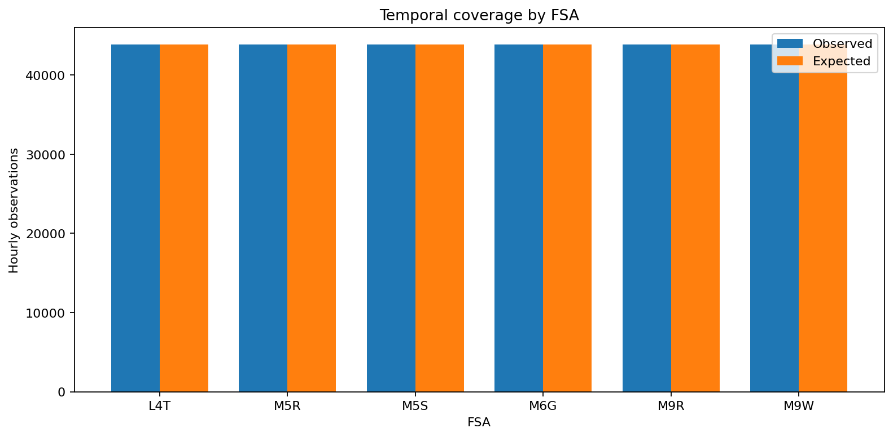
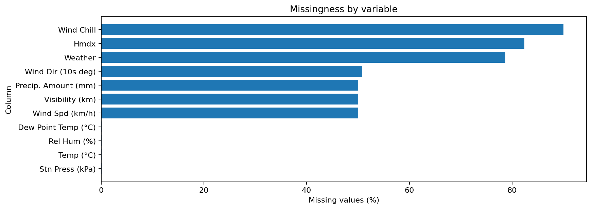

# EDA 05.01 — Dataset Overview and Coverage

This section validates the analytical dataset dimensions, data types, memory footprint, temporal coverage, hourly continuity, and missingness before substantive exploration.

## Dataset overview

|   rows |   columns |   memory_mb |   numeric_columns |   categorical_columns | minimum_timestamp   | maximum_timestamp   |   unique_fsas |
|-------:|----------:|------------:|------------------:|----------------------:|:--------------------|:--------------------|--------------:|
| 262944 |        66 |      70.977 |                54 |                     8 | 2021-01-01 00:00:00 | 2025-12-31 23:00:00 |             6 |

## Temporal coverage by FSA

| fsa   |   rows |   unique_hours | minimum_timestamp   | maximum_timestamp   |   expected_continuous_hours |   missing_hour_count |   duplicate_timestamp_rows |   non_one_hour_gaps | first_missing_examples   |
|:------|-------:|---------------:|:--------------------|:--------------------|----------------------------:|---------------------:|---------------------------:|--------------------:|:-------------------------|
| L4T   |  43824 |          43824 | 2021-01-01 00:00:00 | 2025-12-31 23:00:00 |                       43824 |                    0 |                          0 |                   0 |                          |
| M5R   |  43824 |          43824 | 2021-01-01 00:00:00 | 2025-12-31 23:00:00 |                       43824 |                    0 |                          0 |                   0 |                          |
| M5S   |  43824 |          43824 | 2021-01-01 00:00:00 | 2025-12-31 23:00:00 |                       43824 |                    0 |                          0 |                   0 |                          |
| M6G   |  43824 |          43824 | 2021-01-01 00:00:00 | 2025-12-31 23:00:00 |                       43824 |                    0 |                          0 |                   0 |                          |
| M9R   |  43824 |          43824 | 2021-01-01 00:00:00 | 2025-12-31 23:00:00 |                       43824 |                    0 |                          0 |                   0 |                          |
| M9W   |  43824 |          43824 | 2021-01-01 00:00:00 | 2025-12-31 23:00:00 |                       43824 |                    0 |                          0 |                   0 |                          |

## Variables with missing values

| column              |   missing_count |   missing_pct |
|:--------------------|----------------:|--------------:|
| Wind Chill          |          236598 |     89.9804   |
| Hmdx                |          216654 |     82.3955   |
| Weather             |          206784 |     78.6418   |
| Wind Dir (10s deg)  |          133668 |     50.8352   |
| Precip. Amount (mm) |          131595 |     50.0468   |
| Visibility (km)     |          131493 |     50.008    |
| Wind Spd (km/h)     |          131490 |     50.0068   |
| Dew Point Temp (°C) |             144 |      0.054765 |
| Rel Hum (%)         |             144 |      0.054765 |
| Temp (°C)           |             141 |      0.053624 |
| Stn Press (kPa)     |             141 |      0.053624 |

## Temporal coverage by FSA

## Missingness by variable

