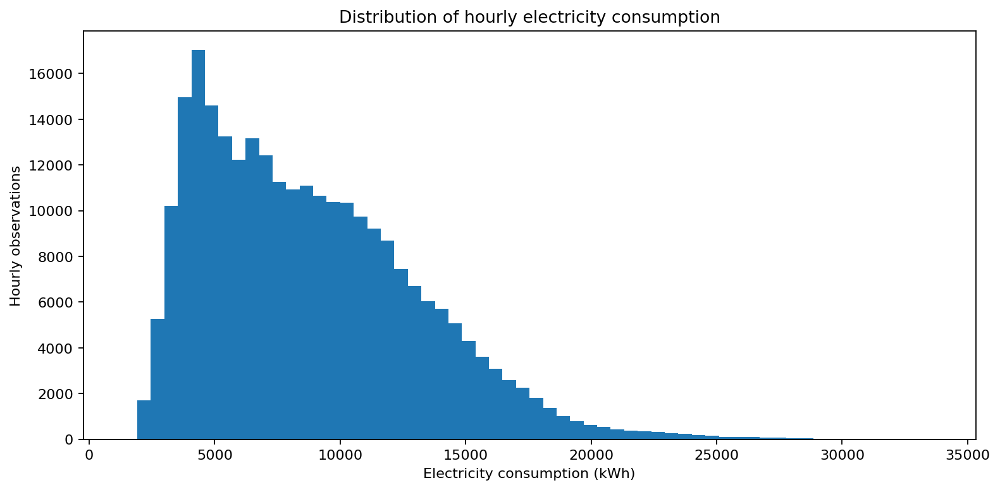
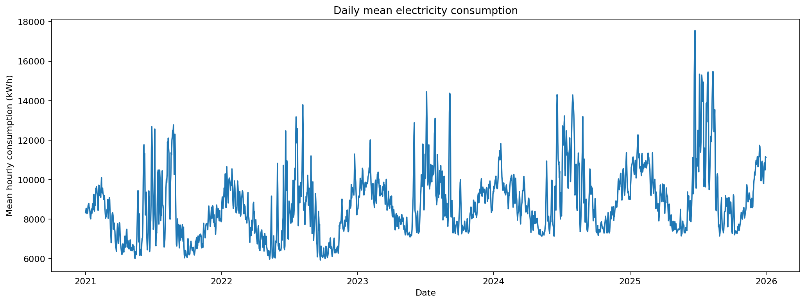
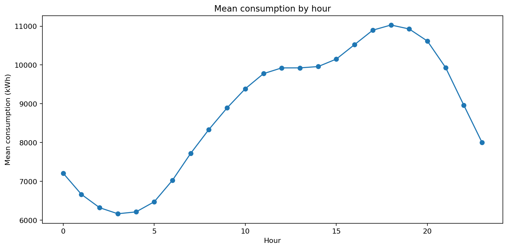
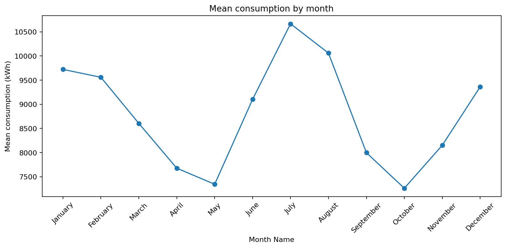
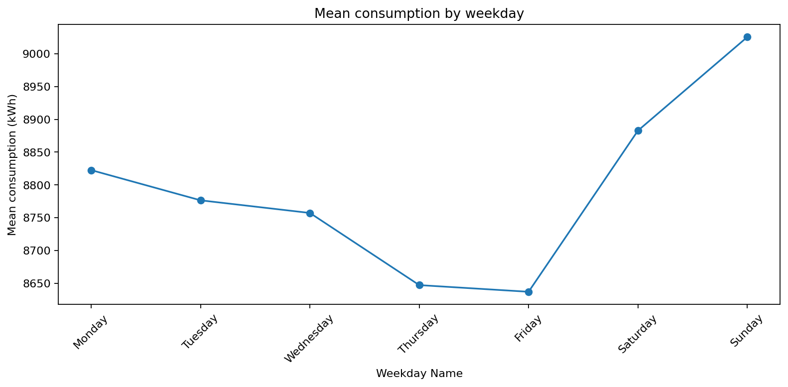
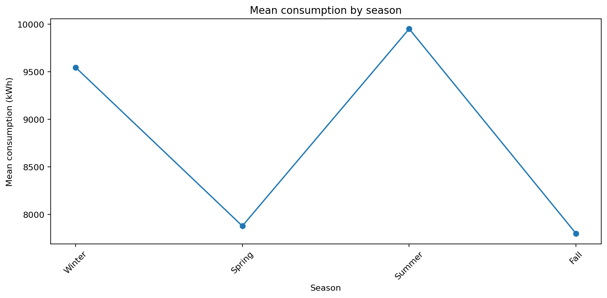
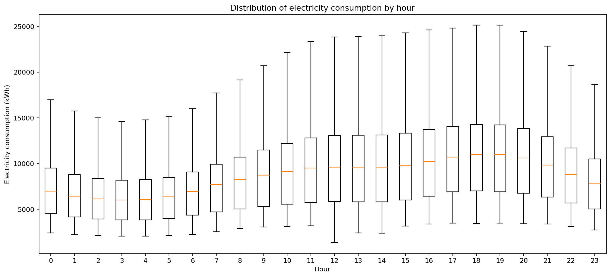
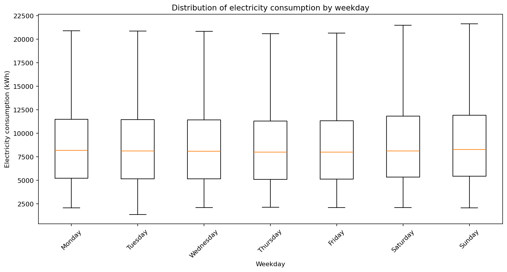
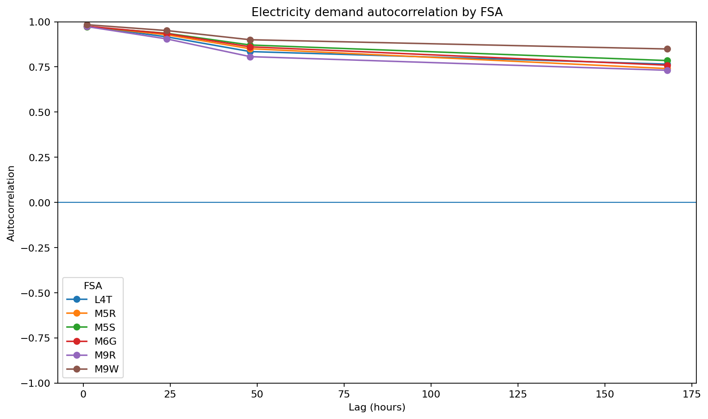
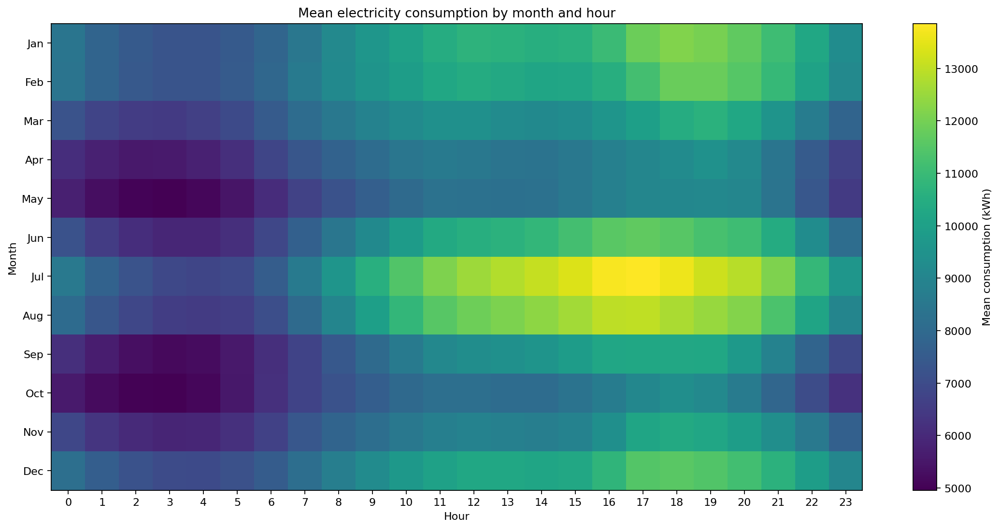

# EDA 05.02 — Target and Temporal Analysis

This section examines the distribution of `total_consumption_kwh`, long-term trends, annual, monthly, weekly, daily, and hourly patterns, and selected target autocorrelations.

## Target statistics

|   count |    mean |   median |   standard_deviation |   minimum |     p01 |    p05 |    p25 |   p75 |   p95 |    p975 |     p99 |   maximum |   skewness |
|--------:|--------:|---------:|---------------------:|----------:|--------:|-------:|-------:|------:|------:|--------:|--------:|----------:|-----------:|
|  262944 | 8792.72 |   8111.4 |              4312.83 |    1377.7 | 2586.33 | 3359.9 | 5224.9 | 11544 | 16623 | 18340.1 | 21178.2 |   33712.2 |   0.849491 |

## Target statistics by FSA

| fsa   |   count |     mean |   median |   standard_deviation |   minimum |   maximum |
|:------|--------:|---------:|---------:|---------------------:|----------:|----------:|
| L4T   |   43824 | 11618    | 11179    |             3441.41  |    5864.4 |   27796.6 |
| M5R   |   43824 |  7662.04 |  7461    |             2019.44  |    3721.5 |   16999   |
| M5S   |   43824 |  4108.75 |  4044.75 |              986.417 |    2060.4 |    7622.4 |
| M6G   |   43824 | 11488.1  | 11243    |             3177.87  |    4954.9 |   27460.1 |
| M9R   |   43824 |  5542.01 |  5211.95 |             1899.71  |    1377.7 |   16243.6 |
| M9W   |   43824 | 12337.4  | 11916.4  |             4405.02  |    4361.1 |   33712.2 |

## Selected autocorrelations

| fsa   |   lag_hours |   autocorrelation |
|:------|------------:|------------------:|
| L4T   |           1 |          0.975482 |
| L4T   |          24 |          0.916333 |
| L4T   |          48 |          0.834719 |
| L4T   |         168 |          0.765211 |
| M5R   |           1 |          0.973775 |
| M5R   |          24 |          0.927628 |
| M5R   |          48 |          0.850673 |
| M5R   |         168 |          0.740614 |
| M5S   |           1 |          0.971764 |
| M5S   |          24 |          0.936118 |
| M5S   |          48 |          0.871159 |
| M5S   |         168 |          0.785091 |
| M6G   |           1 |          0.974962 |
| M6G   |          24 |          0.934419 |
| M6G   |          48 |          0.861014 |
| M6G   |         168 |          0.759387 |
| M9R   |           1 |          0.973121 |
| M9R   |          24 |          0.9049   |
| M9R   |          48 |          0.806666 |
| M9R   |         168 |          0.731192 |
| M9W   |           1 |          0.983574 |
| M9W   |          24 |          0.951148 |
| M9W   |          48 |          0.900311 |
| M9W   |         168 |          0.84915  |

## Target distribution

## Daily trend

## Hourly profile

## Monthly profile

## Weekday profile

## Seasonal profile

## Hourly consumption distribution

## Weekday consumption distribution

## Autocorrelation by FSA

## Month-hour demand heatmap

