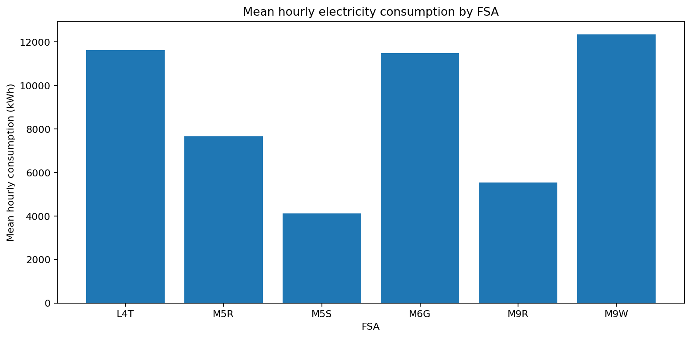
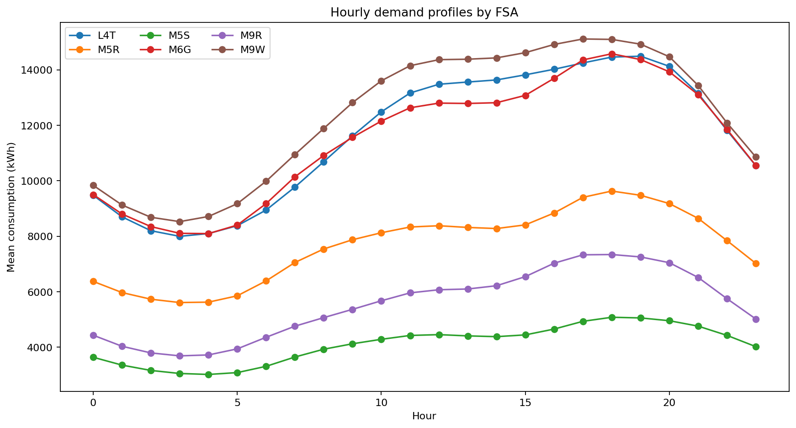
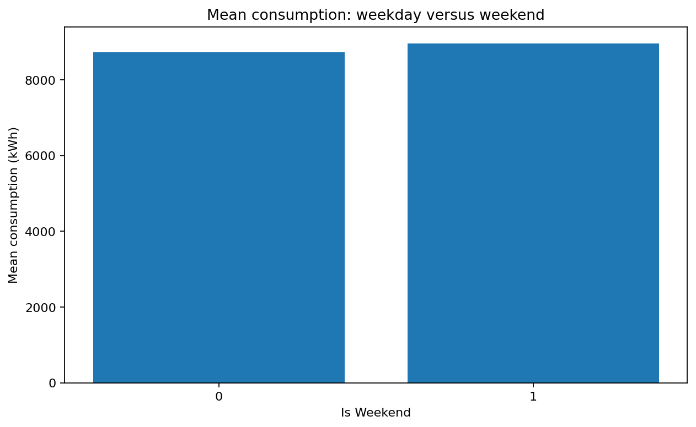
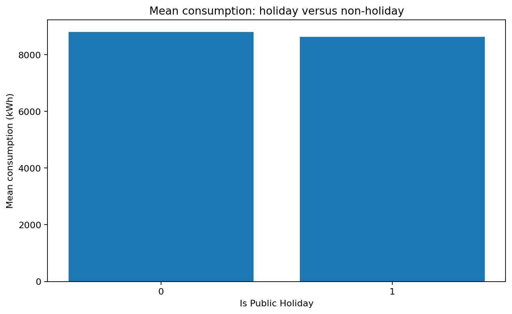
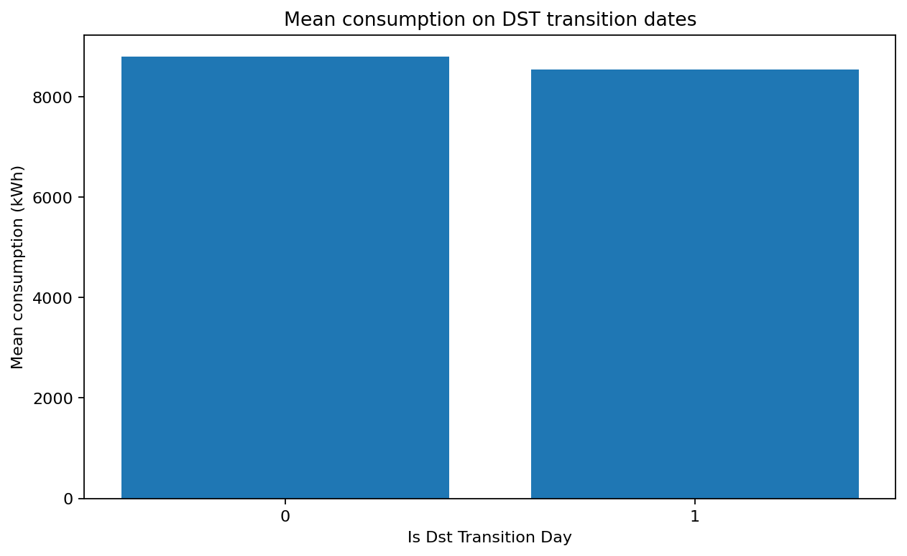
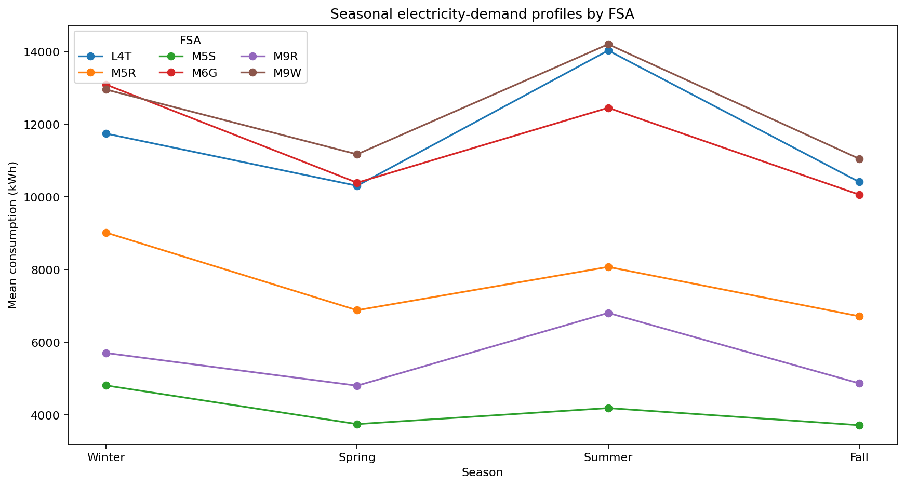
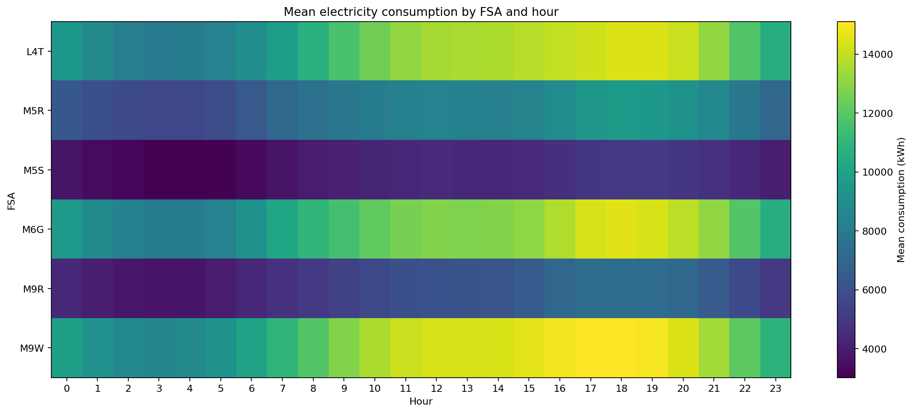

# EDA 05.03 — Spatial and Calendar Analysis

This section compares the six FSAs and evaluates demand differences associated with hourly profiles, weekends, holidays, seasons, quarters, workdays, long weekends, DST periods, and DST transition dates.

## Spatial summary

| fsa   |   hourly_mean |   hourly_median |   hourly_standard_deviation |   hourly_minimum |   hourly_maximum |      p95 |     p975 |      p99 |
|:------|--------------:|----------------:|----------------------------:|-----------------:|-----------------:|---------:|---------:|---------:|
| L4T   |      11618    |        11179    |                    3441.41  |           5864.4 |          27796.6 | 18422.9  | 20880.5  | 23120.9  |
| M5R   |       7662.04 |         7461    |                    2019.44  |           3721.5 |          16999   | 11308.5  | 12100.4  | 13011.5  |
| M5S   |       4108.75 |         4044.75 |                     986.417 |           2060.4 |           7622.4 |  5862.01 |  6213.31 |  6588.37 |
| M6G   |      11488.1  |        11243    |                    3177.87  |           4954.9 |          27460.1 | 16944.7  | 18290.2  | 20200.4  |
| M9R   |       5542.01 |         5211.95 |                    1899.71  |           1377.7 |          16243.6 |  9242.84 | 10783.9  | 12333.5  |
| M9W   |      12337.4  |        11916.4  |                    4405.02  |           4361.1 |          33712.2 | 19432.7  | 22068.4  | 25710.6  |

## Weekend effect

|   is_weekend |   count |    mean |   median |   maximum |
|-------------:|--------:|--------:|---------:|----------:|
|            0 |  187776 | 8728.1  |  8074.8  |   33712.2 |
|            1 |   75168 | 8954.13 |  8197.35 |   31248.5 |

## Holiday effect

|   is_public_holiday |   count |    mean |   median |   maximum |
|--------------------:|--------:|--------:|---------:|----------:|
|                   0 |  255888 | 8797.36 |  8111.05 |   33712.2 |
|                   1 |    7056 | 8624.32 |  8121.55 |   28494.6 |

## DST transition effect

|   is_dst_transition_day |   count |    mean |   median |   maximum |
|------------------------:|--------:|--------:|---------:|----------:|
|                       0 |  261504 | 8794.11 |   8112.3 |   33712.2 |
|                       1 |    1440 | 8538.97 |   7942.6 |   17902.7 |

## Consumption by FSA

## Hourly profiles by FSA

## Weekend effect

## Holiday effect

## DST transition effect

## Seasonal profiles by FSA

## FSA × Hour heatmap

