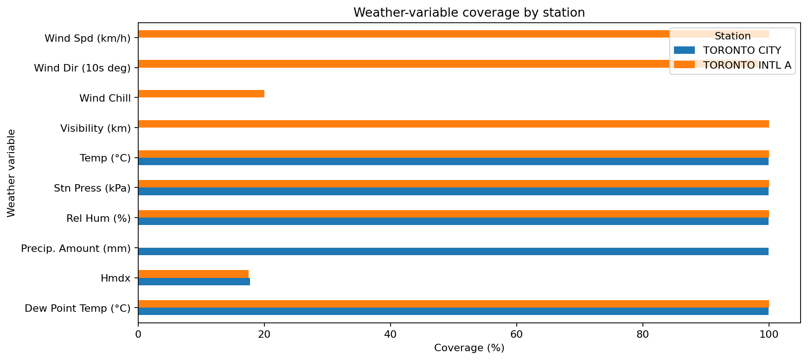
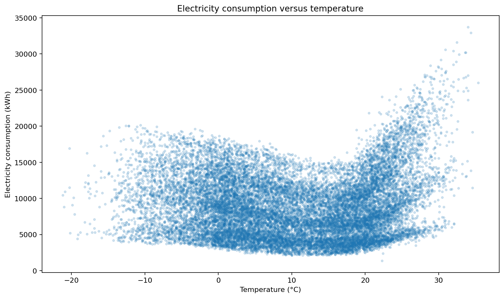
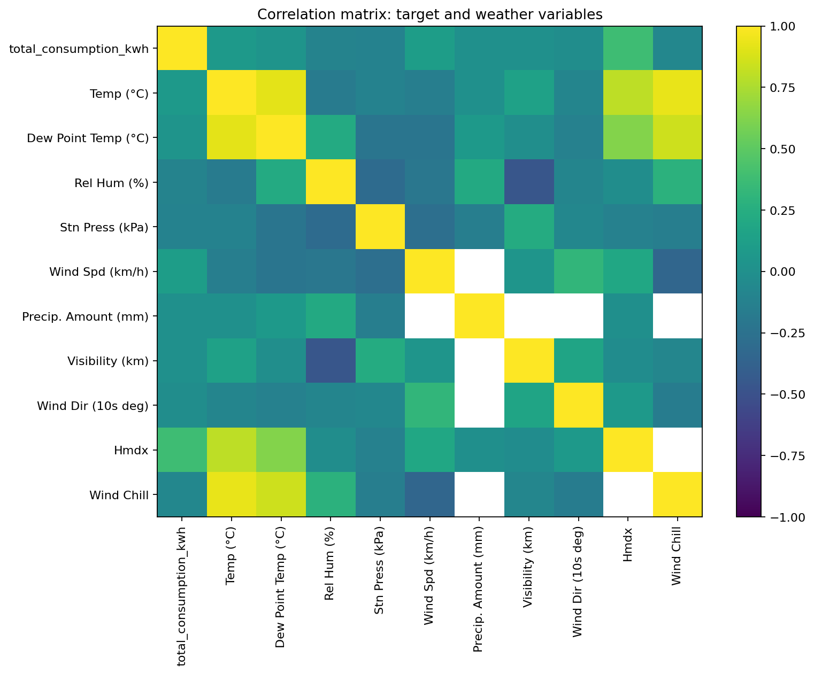
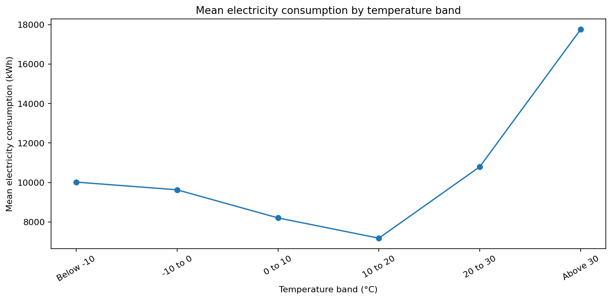
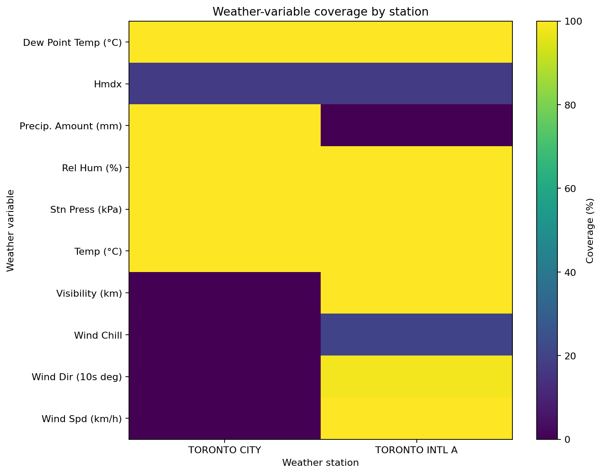

# EDA 05.04 — Weather, Correlation, and Missingness

This section examines weather coverage by station, FSA, and year; missingness overlap; demand-weather relationships; and a preliminary retention review. No variable is automatically removed.

## Weather coverage by station

|   assigned_climate_id | assigned_station_name   | column              |   rows |   non_null_count |   missing_count |   coverage_pct |
|----------------------:|:------------------------|:--------------------|-------:|-----------------:|----------------:|---------------:|
|               6158355 | TORONTO CITY            | Temp (°C)           | 131472 |           131349 |             123 |        99.9064 |
|               6158355 | TORONTO CITY            | Dew Point Temp (°C) | 131472 |           131349 |             123 |        99.9064 |
|               6158355 | TORONTO CITY            | Rel Hum (%)         | 131472 |           131349 |             123 |        99.9064 |
|               6158355 | TORONTO CITY            | Stn Press (kPa)     | 131472 |           131349 |             123 |        99.9064 |
|               6158355 | TORONTO CITY            | Wind Spd (km/h)     | 131472 |                0 |          131472 |         0      |
|               6158355 | TORONTO CITY            | Precip. Amount (mm) | 131472 |           131349 |             123 |        99.9064 |
|               6158355 | TORONTO CITY            | Visibility (km)     | 131472 |                0 |          131472 |         0      |
|               6158355 | TORONTO CITY            | Wind Dir (10s deg)  | 131472 |                0 |          131472 |         0      |
|               6158355 | TORONTO CITY            | Hmdx                | 131472 |            23292 |          108180 |        17.7163 |
|               6158355 | TORONTO CITY            | Wind Chill          | 131472 |                0 |          131472 |         0      |
|               6158731 | TORONTO INTL A          | Temp (°C)           | 131472 |           131454 |              18 |        99.9863 |
|               6158731 | TORONTO INTL A          | Dew Point Temp (°C) | 131472 |           131451 |              21 |        99.984  |
|               6158731 | TORONTO INTL A          | Rel Hum (%)         | 131472 |           131451 |              21 |        99.984  |
|               6158731 | TORONTO INTL A          | Stn Press (kPa)     | 131472 |           131454 |              18 |        99.9863 |
|               6158731 | TORONTO INTL A          | Wind Spd (km/h)     | 131472 |           131454 |              18 |        99.9863 |
|               6158731 | TORONTO INTL A          | Precip. Amount (mm) | 131472 |                0 |          131472 |         0      |
|               6158731 | TORONTO INTL A          | Visibility (km)     | 131472 |           131451 |              21 |        99.984  |
|               6158731 | TORONTO INTL A          | Wind Dir (10s deg)  | 131472 |           129276 |            2196 |        98.3297 |
|               6158731 | TORONTO INTL A          | Hmdx                | 131472 |            22998 |          108474 |        17.4927 |
|               6158731 | TORONTO INTL A          | Wind Chill          | 131472 |            26346 |          105126 |        20.0392 |

## Target-weather correlations

| weather_variable    |   pairwise_rows |   coverage_pct |   pearson_correlation | pearson_strength   |   spearman_correlation | spearman_strength   |
|:--------------------|----------------:|---------------:|----------------------:|:-------------------|-----------------------:|:--------------------|
| Hmdx                |           46290 |        17.6045 |            0.378096   | weak               |             0.314041   | weak                |
| Wind Spd (km/h)     |          131454 |        49.9932 |            0.111686   | very weak          |             0.121575   | very weak           |
| Stn Press (kPa)     |          262803 |        99.9464 |           -0.109696   | very weak          |            -0.112676   | very weak           |
| Rel Hum (%)         |          262800 |        99.9452 |           -0.105441   | very weak          |            -0.0994657  | very weak           |
| Wind Chill          |           26346 |        10.0196 |           -0.0732744  | very weak          |            -0.0802628  | very weak           |
| Temp (°C)           |          262803 |        99.9464 |            0.0809305  | very weak          |             0.0322291  | very weak           |
| Wind Dir (10s deg)  |          129276 |        49.1648 |           -0.0197863  | very weak          |            -0.0300359  | very weak           |
| Visibility (km)     |          131451 |        49.992  |            0.00278461 | very weak          |            -0.0143479  | very weak           |
| Precip. Amount (mm) |          131349 |        49.9532 |            0.00296303 | very weak          |             0.0121508  | very weak           |
| Dew Point Temp (°C) |          262800 |        99.9452 |            0.03886    | very weak          |            -0.00356792 | very weak           |

## Temperature bands

| temperature_band   |   count |     mean |   median |   maximum |
|:-------------------|--------:|---------:|---------:|----------:|
| Below -10          |    5055 | 10017.9  |   9911.8 |   20741.6 |
| -10 to 0           |   43314 |  9628.85 |   9376.5 |   20662.3 |
| 0 to 10            |   82659 |  8204.4  |   7714.5 |   18769   |
| 10 to 20           |   74670 |  7176.64 |   6657.9 |   20451.4 |
| 20 to 30           |   55308 | 10796.9  |  10097.7 |   30500.3 |
| Above 30           |    1797 | 17760.4  |  17578.7 |   33712.2 |

## Preliminary weather-variable retention review

| column              |   mean_coverage_pct |   spearman_correlation | spearman_strength   | eda_recommendation                    |
|:--------------------|--------------------:|-----------------------:|:--------------------|:--------------------------------------|
| Dew Point Temp (°C) |             99.9452 |            -0.00356792 | very weak           | retain_pending_multivariate_review    |
| Hmdx                |             17.6045 |             0.314041   | weak                | review_for_exclusion_low_coverage     |
| Precip. Amount (mm) |             49.9532 |             0.0121508  | very weak           | retain_for_eda_review_before_modeling |
| Rel Hum (%)         |             99.9452 |            -0.0994657  | very weak           | retain_pending_multivariate_review    |
| Stn Press (kPa)     |             99.9464 |            -0.112676   | very weak           | retain_pending_multivariate_review    |
| Temp (°C)           |             99.9464 |             0.0322291  | very weak           | retain_pending_multivariate_review    |
| Visibility (km)     |             49.992  |            -0.0143479  | very weak           | retain_for_eda_review_before_modeling |
| Wind Chill          |             10.0196 |            -0.0802628  | very weak           | review_for_exclusion_low_coverage     |
| Wind Dir (10s deg)  |             49.1648 |            -0.0300359  | very weak           | retain_for_eda_review_before_modeling |
| Wind Spd (km/h)     |             49.9932 |             0.121575   | very weak           | retain_for_eda_review_before_modeling |

## Weather coverage by station

## Consumption versus temperature

## Weather correlation matrix

## Consumption by temperature band

## Weather coverage heatmap

