# EDA 05.05 — Extremes, Exploratory Peaks, and Feature Review

Exploratory Peak hours are defined temporarily using the 0.975 quantile by FSA and season. This definition is descriptive only and must not be reused as the final modeling target without recalculating thresholds inside each training window.

## Highest-demand hours

| fsa   | timestamp           |   total_consumption_kwh |   Temp (°C) |   Rel Hum (%) | season   |   hour | weekday_name   |   is_weekend |   is_public_holiday | assigned_station_name   |
|:------|:--------------------|------------------------:|------------:|--------------:|:---------|-------:|:---------------|-------------:|--------------------:|:------------------------|
| M9W   | 2025-06-24 14:00:00 |                 33712.2 |        34   |            47 | Summer   |     14 | Tuesday        |            0 |                   0 | TORONTO INTL A          |
| M9W   | 2025-06-24 15:00:00 |                 33617.2 |        34.8 |            43 | Summer   |     15 | Tuesday        |            0 |                   0 | TORONTO INTL A          |
| M9W   | 2025-06-24 13:00:00 |                 33566.5 |        34.7 |            44 | Summer   |     13 | Tuesday        |            0 |                   0 | TORONTO INTL A          |
| M9W   | 2025-06-23 16:00:00 |                 33203   |        35.8 |            39 | Summer   |     16 | Monday         |            0 |                   0 | TORONTO INTL A          |
| M9W   | 2025-06-23 15:00:00 |                 33183.9 |        35.7 |            37 | Summer   |     15 | Monday         |            0 |                   0 | TORONTO INTL A          |
| M9W   | 2025-06-24 12:00:00 |                 32941   |        34.4 |            47 | Summer   |     12 | Tuesday        |            0 |                   0 | TORONTO INTL A          |
| M9W   | 2025-06-23 17:00:00 |                 32709   |        35.2 |            36 | Summer   |     17 | Monday         |            0 |                   0 | TORONTO INTL A          |
| M9W   | 2025-06-23 14:00:00 |                 32661.3 |        35.2 |            42 | Summer   |     14 | Monday         |            0 |                   0 | TORONTO INTL A          |
| M9W   | 2025-06-24 16:00:00 |                 32556.8 |        34.3 |            44 | Summer   |     16 | Tuesday        |            0 |                   0 | TORONTO INTL A          |
| M9W   | 2025-06-23 18:00:00 |                 32295.9 |        33.6 |            49 | Summer   |     18 | Monday         |            0 |                   0 | TORONTO INTL A          |
| M9W   | 2025-06-24 11:00:00 |                 32288.4 |        33.7 |            48 | Summer   |     11 | Tuesday        |            0 |                   0 | TORONTO INTL A          |
| M9W   | 2025-06-24 17:00:00 |                 32109.1 |        33.7 |            45 | Summer   |     17 | Tuesday        |            0 |                   0 | TORONTO INTL A          |
| M9W   | 2025-06-23 13:00:00 |                 32059.3 |        34.8 |            45 | Summer   |     13 | Monday         |            0 |                   0 | TORONTO INTL A          |
| M9W   | 2025-08-11 14:00:00 |                 32007.9 |        32.3 |            47 | Summer   |     14 | Monday         |            0 |                   0 | TORONTO INTL A          |
| M9W   | 2025-06-23 12:00:00 |                 31766.7 |        34.4 |            46 | Summer   |     12 | Monday         |            0 |                   0 | TORONTO INTL A          |
| M9W   | 2025-06-23 19:00:00 |                 31603.4 |        32.5 |            52 | Summer   |     19 | Monday         |            0 |                   0 | TORONTO INTL A          |
| M9W   | 2025-07-24 16:00:00 |                 31498.5 |        33.2 |            54 | Summer   |     16 | Thursday       |            0 |                   0 | TORONTO INTL A          |
| M9W   | 2025-08-12 14:00:00 |                 31481.4 |        32.2 |            49 | Summer   |     14 | Tuesday        |            0 |                   0 | TORONTO INTL A          |
| M9W   | 2025-07-28 15:00:00 |                 31479.3 |        32.9 |            42 | Summer   |     15 | Monday         |            0 |                   0 | TORONTO INTL A          |
| M9W   | 2025-07-24 15:00:00 |                 31437.1 |        32.3 |            57 | Summer   |     15 | Thursday       |            0 |                   0 | TORONTO INTL A          |
| M9W   | 2025-06-24 18:00:00 |                 31373.6 |        32.4 |            46 | Summer   |     18 | Tuesday        |            0 |                   0 | TORONTO INTL A          |
| M9W   | 2025-08-11 13:00:00 |                 31341.5 |        31.6 |            50 | Summer   |     13 | Monday         |            0 |                   0 | TORONTO INTL A          |
| M9W   | 2025-08-12 13:00:00 |                 31335.7 |        33.8 |            45 | Summer   |     13 | Tuesday        |            0 |                   0 | TORONTO INTL A          |
| M9W   | 2025-06-22 16:00:00 |                 31248.5 |        34.5 |            53 | Summer   |     16 | Sunday         |            1 |                   0 | TORONTO INTL A          |
| M9W   | 2025-08-11 15:00:00 |                 31143.5 |        31.1 |            48 | Summer   |     15 | Monday         |            0 |                   0 | TORONTO INTL A          |
| M9W   | 2025-07-29 14:00:00 |                 31112.8 |        30.5 |            49 | Summer   |     14 | Tuesday        |            0 |                   0 | TORONTO INTL A          |
| M9W   | 2025-06-24 10:00:00 |                 31054.5 |        32.8 |            53 | Summer   |     10 | Tuesday        |            0 |                   0 | TORONTO INTL A          |
| M9W   | 2025-06-22 17:00:00 |                 31034.9 |        34   |            53 | Summer   |     17 | Sunday         |            1 |                   0 | TORONTO INTL A          |
| M9W   | 2025-07-29 15:00:00 |                 31008.9 |        30.7 |            46 | Summer   |     15 | Tuesday        |            0 |                   0 | TORONTO INTL A          |
| M9W   | 2025-06-23 20:00:00 |                 30996.5 |        30.9 |            57 | Summer   |     20 | Monday         |            0 |                   0 | TORONTO INTL A          |
| M9W   | 2025-06-23 11:00:00 |                 30961.8 |        33.2 |            54 | Summer   |     11 | Monday         |            0 |                   0 | TORONTO INTL A          |
| M9W   | 2025-07-28 14:00:00 |                 30946.7 |        31.7 |            48 | Summer   |     14 | Monday         |            0 |                   0 | TORONTO INTL A          |
| M9W   | 2025-07-28 16:00:00 |                 30883   |        32.8 |            44 | Summer   |     16 | Monday         |            0 |                   0 | TORONTO INTL A          |
| M9W   | 2025-07-06 16:00:00 |                 30855.1 |        34.3 |            34 | Summer   |     16 | Sunday         |            1 |                   0 | TORONTO INTL A          |
| M9W   | 2025-06-22 15:00:00 |                 30841.1 |        34.2 |            57 | Summer   |     15 | Sunday         |            1 |                   0 | TORONTO INTL A          |
| M9W   | 2025-07-24 14:00:00 |                 30798.7 |        32   |            60 | Summer   |     14 | Thursday       |            0 |                   0 | TORONTO INTL A          |
| M9W   | 2025-06-22 18:00:00 |                 30697.4 |        33.6 |            53 | Summer   |     18 | Sunday         |            1 |                   0 | TORONTO INTL A          |
| M9W   | 2025-08-11 16:00:00 |                 30684.6 |        31.8 |            45 | Summer   |     16 | Monday         |            0 |                   0 | TORONTO INTL A          |
| M9W   | 2025-07-06 15:00:00 |                 30670.4 |        33.9 |            32 | Summer   |     15 | Sunday         |            1 |                   0 | TORONTO INTL A          |
| M9W   | 2025-07-16 15:00:00 |                 30583   |        30.9 |            48 | Summer   |     15 | Wednesday      |            0 |                   0 | TORONTO INTL A          |
| M9W   | 2025-07-24 17:00:00 |                 30582.4 |        32.7 |            53 | Summer   |     17 | Thursday       |            0 |                   0 | TORONTO INTL A          |
| M9W   | 2025-07-06 17:00:00 |                 30507   |        33.2 |            38 | Summer   |     17 | Sunday         |            1 |                   0 | TORONTO INTL A          |
| M9W   | 2025-08-11 12:00:00 |                 30500.3 |        30   |            55 | Summer   |     12 | Monday         |            0 |                   0 | TORONTO INTL A          |
| M9W   | 2025-07-29 16:00:00 |                 30491.2 |        31.7 |            43 | Summer   |     16 | Tuesday        |            0 |                   0 | TORONTO INTL A          |
| M9W   | 2025-08-12 12:00:00 |                 30397.2 |        32   |            53 | Summer   |     12 | Tuesday        |            0 |                   0 | TORONTO INTL A          |
| M9W   | 2025-07-29 13:00:00 |                 30326.7 |        30.7 |            49 | Summer   |     13 | Tuesday        |            0 |                   0 | TORONTO INTL A          |
| M9W   | 2025-07-16 14:00:00 |                 30315.5 |        32.4 |            45 | Summer   |     14 | Wednesday      |            0 |                   0 | TORONTO INTL A          |
| M9W   | 2025-07-06 14:00:00 |                 30267.7 |        34   |            31 | Summer   |     14 | Sunday         |            1 |                   0 | TORONTO INTL A          |
| M9W   | 2025-07-28 17:00:00 |                 30260.1 |        32.1 |            47 | Summer   |     17 | Monday         |            0 |                   0 | TORONTO INTL A          |
| M9W   | 2025-07-28 13:00:00 |                 30248.9 |        32.5 |            44 | Summer   |     13 | Monday         |            0 |                   0 | TORONTO INTL A          |

## Highest-demand FSA-days

| fsa   | date_analysis       |   daily_total_kwh |   daily_mean_kwh |   maximum_hourly_kwh |   mean_temperature_c |
|:------|:--------------------|------------------:|-----------------:|---------------------:|---------------------:|
| M9W   | 2025-06-24 00:00:00 |            652912 |          27204.7 |              33712.2 |              29.95   |
| M9W   | 2025-06-23 00:00:00 |            640718 |          26696.6 |              33203   |              29.9458 |
| M9W   | 2025-08-11 00:00:00 |            577356 |          24056.5 |              32007.9 |              27.8417 |
| M9W   | 2025-07-29 00:00:00 |            576470 |          24019.6 |              31112.8 |              26.7375 |
| M9W   | 2025-06-25 00:00:00 |            573102 |          23879.3 |              30101.1 |              26.2833 |
| M9W   | 2025-07-28 00:00:00 |            571828 |          23826.2 |              31479.3 |              27.425  |
| M9W   | 2025-07-06 00:00:00 |            568133 |          23672.2 |              30855.1 |              29.0875 |
| M9W   | 2025-08-12 00:00:00 |            568041 |          23668.4 |              31481.4 |              27.0125 |
| M9W   | 2025-06-22 00:00:00 |            565658 |          23569.1 |              31248.5 |              29.8583 |
| M9W   | 2025-07-12 00:00:00 |            561708 |          23404.5 |              30235.6 |              28.1083 |
| M9W   | 2025-07-07 00:00:00 |            554857 |          23119   |              29024   |              25.825  |
| M9W   | 2025-07-16 00:00:00 |            553607 |          23067   |              30583   |              26.6417 |
| M9W   | 2025-08-10 00:00:00 |            550025 |          22917.7 |              30035.1 |              27.4083 |
| L4T   | 2025-06-24 00:00:00 |            548344 |          22847.7 |              27521.6 |              29.95   |
| L4T   | 2025-06-23 00:00:00 |            547832 |          22826.3 |              27578.8 |              29.9458 |
| M9W   | 2023-07-05 00:00:00 |            539093 |          22462.2 |              29045.3 |              27.2708 |
| M9W   | 2023-09-05 00:00:00 |            537415 |          22392.3 |              29812.2 |              26.5542 |
| M9W   | 2024-06-19 00:00:00 |            537004 |          22375.2 |              30178.2 |              27.4917 |
| M9W   | 2023-09-06 00:00:00 |            536599 |          22358.3 |              29740.5 |              26.1125 |
| M9W   | 2025-07-13 00:00:00 |            536559 |          22356.6 |              28699   |              26.5917 |

## Exploratory Peak thresholds

| fsa   | season   |   exploratory_peak_threshold_kwh |
|:------|:---------|---------------------------------:|
| L4T   | Fall     |                         16207.3  |
| L4T   | Spring   |                         14568.3  |
| L4T   | Summer   |                         23822.4  |
| L4T   | Winter   |                         15546.2  |
| M5R   | Fall     |                          9800.82 |
| M5R   | Spring   |                         10007    |
| M5R   | Summer   |                         13102.4  |
| M5R   | Winter   |                         12488.2  |
| M5S   | Fall     |                          5295.31 |
| M5S   | Spring   |                          5386.4  |
| M5S   | Summer   |                          6356.26 |
| M5S   | Winter   |                          6583.99 |
| M6G   | Fall     |                         14973.6  |
| M6G   | Spring   |                         15102.6  |
| M6G   | Summer   |                         21037    |
| M6G   | Winter   |                         17807.2  |
| M9R   | Fall     |                          7830.49 |
| M9R   | Spring   |                          7050.01 |
| M9R   | Summer   |                         12841    |
| M9R   | Winter   |                          7968.4  |
| M9W   | Fall     |                         18070    |
| M9W   | Spring   |                         16961.9  |
| M9W   | Summer   |                         26843.3  |
| M9W   | Winter   |                         18704.2  |

## Exploratory Peak counts by FSA

| fsa   |   rows |   exploratory_peak_hours |   exploratory_peak_pct |   peak_mean_consumption_kwh |
|:------|-------:|-------------------------:|-----------------------:|----------------------------:|
| L4T   |  43824 |                     1096 |                2.50091 |                    18955.4  |
| M5R   |  43824 |                     1096 |                2.50091 |                    12103.8  |
| M5S   |  43824 |                     1096 |                2.50091 |                     6225.73 |
| M6G   |  43824 |                     1096 |                2.50091 |                    18451.3  |
| M9R   |  43824 |                     1096 |                2.50091 |                     9827.72 |
| M9W   |  43824 |                     1096 |                2.50091 |                    21700.2  |

## Temperature extremes

| fsa   | temperature_extreme   |   count |   mean_consumption_kwh |   median_consumption_kwh |   maximum_consumption_kwh |   mean_temperature_c |
|:------|:----------------------|--------:|-----------------------:|-------------------------:|--------------------------:|---------------------:|
| L4T   | coldest_1_percent     |     576 |               12095.6  |                  11606.3 |                   17348.1 |            -14.4451  |
| L4T   | hottest_1_percent     |     543 |               23175.3  |                  23573.6 |                   27796.6 |             30.9424  |
| L4T   | non_extreme           |   42699 |               11464.3  |                  11123   |                   25855   |              9.99046 |
| M5R   | coldest_1_percent     |     326 |               10345.6  |                  10198.2 |                   14039.3 |            -14.2902  |
| M5R   | hottest_1_percent     |     334 |               13139.1  |                  13167.4 |                   16999   |             30.7913  |
| M5R   | non_extreme           |   43123 |                7599.31 |                   7423.4 |                   15302.1 |             10.5233  |
| M5S   | coldest_1_percent     |     326 |                5509.38 |                   5398.6 |                    7438.5 |            -14.2902  |
| M5S   | hottest_1_percent     |     334 |                6274.35 |                   6294.9 |                    7533.8 |             30.7913  |
| M5S   | non_extreme           |   43123 |                4081.53 |                   4025.3 |                    7622.4 |             10.5233  |
| M6G   | coldest_1_percent     |     326 |               14255.2  |                  14069.8 |                   20236.4 |            -14.2902  |
| M6G   | hottest_1_percent     |     334 |               20834    |                  20941.8 |                   27460.1 |             30.7913  |
| M6G   | non_extreme           |   43123 |               11394.5  |                  11189.2 |                   24579   |             10.5233  |
| M9R   | coldest_1_percent     |     576 |                5667.55 |                   5468.6 |                    9005.7 |            -14.4451  |
| M9R   | hottest_1_percent     |     543 |               12181.3  |                  12405.6 |                   16243.6 |             30.9424  |
| M9R   | non_extreme           |   42699 |                5455.74 |                   5182.4 |                   14652.3 |              9.99046 |
| M9W   | coldest_1_percent     |     576 |               11746.2  |                  11112.4 |                   20741.6 |            -14.4451  |
| M9W   | hottest_1_percent     |     543 |               23246.6  |                  22521.7 |                   33712.2 |             30.9424  |
| M9W   | non_extreme           |   42699 |               12206.4  |                  11847.5 |                   30101.1 |              9.99046 |

## Preliminary feature review

| column                  | dtype               |   missing_pct |   unique_count | preliminary_recommendation                              | reason                                                                    |
|:------------------------|:--------------------|--------------:|---------------:|:--------------------------------------------------------|:--------------------------------------------------------------------------|
| fsa                     | category            |      0        |              6 | retain_candidate                                        | Potentially useful predictor; final selection requires validation.        |
| timestamp               | datetime64[ns]      |      0        |          43824 | retain_for_traceability_not_directly_as_numeric_feature | Identifier or temporal audit field.                                       |
| total_consumption_kwh   | float64             |      0        |         157393 | target_keep                                             | Primary forecasting target.                                               |
| reported_premise_count  | Int64               |      0        |           1269 | retain_candidate                                        | Potentially useful predictor; final selection requires validation.        |
| source_segment_count    | Int8                |      0        |              6 | retain_candidate                                        | Potentially useful predictor; final selection requires validation.        |
| customer_type_count     | Int8                |      0        |              2 | retain_candidate                                        | Potentially useful predictor; final selection requires validation.        |
| price_plan_count        | Int8                |      0        |              3 | retain_candidate                                        | Potentially useful predictor; final selection requires validation.        |
| timestamp_utc           | datetime64[ns, UTC] |      0        |          43824 | retain_for_traceability_not_directly_as_numeric_feature | Identifier or temporal audit field.                                       |
| timestamp_toronto       | datetime64[ns, UTC] |      0        |          43824 | retain_for_traceability_not_directly_as_numeric_feature | Identifier or temporal audit field.                                       |
| date                    | datetime64[ns]      |      0        |           1826 | retain_for_traceability_not_directly_as_numeric_feature | Identifier or temporal audit field.                                       |
| year                    | Int16               |      0        |              5 | retain_candidate                                        | Potentially useful predictor; final selection requires validation.        |
| quarter                 | Int8                |      0        |              4 | retain_candidate                                        | Potentially useful predictor; final selection requires validation.        |
| month                   | Int8                |      0        |             12 | retain_candidate                                        | Potentially useful predictor; final selection requires validation.        |
| month_name              | category            |      0        |             12 | review_encoding_or_redundancy                           | Categorical/descriptive field may duplicate encoded calendar information. |
| week_of_year            | Int8                |      0        |             53 | retain_candidate                                        | Potentially useful predictor; final selection requires validation.        |
| day_of_year             | Int16               |      0        |            366 | retain_candidate                                        | Potentially useful predictor; final selection requires validation.        |
| day_of_month            | Int8                |      0        |             31 | retain_candidate                                        | Potentially useful predictor; final selection requires validation.        |
| hour                    | Int8                |      0        |             24 | retain_candidate                                        | Potentially useful predictor; final selection requires validation.        |
| hour_group              | category            |      0        |              4 | retain_candidate                                        | Potentially useful predictor; final selection requires validation.        |
| weekday                 | Int8                |      0        |              7 | retain_candidate                                        | Potentially useful predictor; final selection requires validation.        |
| weekday_name            | category            |      0        |              7 | review_encoding_or_redundancy                           | Categorical/descriptive field may duplicate encoded calendar information. |
| is_weekend              | Int8                |      0        |              2 | retain_candidate                                        | Potentially useful predictor; final selection requires validation.        |
| is_workday              | Int8                |      0        |              2 | retain_candidate                                        | Potentially useful predictor; final selection requires validation.        |
| is_monday               | Int8                |      0        |              2 | retain_candidate                                        | Potentially useful predictor; final selection requires validation.        |
| is_friday               | Int8                |      0        |              2 | retain_candidate                                        | Potentially useful predictor; final selection requires validation.        |
| season                  | category            |      0        |              4 | retain_candidate                                        | Potentially useful predictor; final selection requires validation.        |
| is_business_hour        | Int8                |      0        |              2 | retain_candidate                                        | Potentially useful predictor; final selection requires validation.        |
| is_peak_hour_window     | Int8                |      0        |              2 | retain_candidate                                        | Potentially useful predictor; final selection requires validation.        |
| is_month_start          | Int8                |      0        |              2 | retain_candidate                                        | Potentially useful predictor; final selection requires validation.        |
| is_month_end            | Int8                |      0        |              2 | retain_candidate                                        | Potentially useful predictor; final selection requires validation.        |
| is_year_start           | Int8                |      0        |              2 | retain_candidate                                        | Potentially useful predictor; final selection requires validation.        |
| is_year_end             | Int8                |      0        |              2 | retain_candidate                                        | Potentially useful predictor; final selection requires validation.        |
| is_public_holiday       | Int8                |      0        |              2 | retain_candidate                                        | Potentially useful predictor; final selection requires validation.        |
| holiday_name            | category            |      0        |             14 | review_encoding_or_redundancy                           | Categorical/descriptive field may duplicate encoded calendar information. |
| is_day_before_holiday   | Int8                |      0        |              2 | retain_candidate                                        | Potentially useful predictor; final selection requires validation.        |
| is_day_after_holiday    | Int8                |      0        |              2 | retain_candidate                                        | Potentially useful predictor; final selection requires validation.        |
| days_to_holiday         | Int16               |      0        |             77 | retain_candidate                                        | Potentially useful predictor; final selection requires validation.        |
| days_after_holiday      | Int16               |      0        |             77 | retain_candidate                                        | Potentially useful predictor; final selection requires validation.        |
| is_long_weekend         | Int8                |      0        |              2 | retain_candidate                                        | Potentially useful predictor; final selection requires validation.        |
| is_daylight_saving_time | Int8                |      0        |              2 | retain_candidate                                        | Potentially useful predictor; final selection requires validation.        |
| is_dst_transition_day   | Int8                |      0        |              2 | retain_candidate                                        | Potentially useful predictor; final selection requires validation.        |
| is_spring_forward_day   | Int8                |      0        |              2 | retain_candidate                                        | Potentially useful predictor; final selection requires validation.        |
| is_fall_back_day        | Int8                |      0        |              2 | retain_candidate                                        | Potentially useful predictor; final selection requires validation.        |
| utc_offset_hours        | Int8                |      0        |              2 | retain_candidate                                        | Potentially useful predictor; final selection requires validation.        |
| date_index              | Int32               |      0        |           1826 | retain_candidate                                        | Potentially useful predictor; final selection requires validation.        |
| hour_sin                | float64             |      0        |             20 | retain_candidate                                        | Potentially useful predictor; final selection requires validation.        |
| hour_cos                | float64             |      0        |             22 | retain_candidate                                        | Potentially useful predictor; final selection requires validation.        |
| weekday_sin             | float64             |      0        |              7 | retain_candidate                                        | Potentially useful predictor; final selection requires validation.        |
| weekday_cos             | float64             |      0        |              7 | retain_candidate                                        | Potentially useful predictor; final selection requires validation.        |
| month_sin               | float64             |      0        |             11 | retain_candidate                                        | Potentially useful predictor; final selection requires validation.        |
| month_cos               | float64             |      0        |             11 | retain_candidate                                        | Potentially useful predictor; final selection requires validation.        |
| assigned_climate_id     | Int64               |      0        |              2 | retain_for_traceability_not_directly_as_numeric_feature | Identifier or temporal audit field.                                       |
| assigned_station_name   | category            |      0        |              2 | retain_for_traceability_not_directly_as_numeric_feature | Identifier or temporal audit field.                                       |
| Longitude (x)           | float64             |      0        |              2 | retain_candidate                                        | Potentially useful predictor; final selection requires validation.        |
| Latitude (y)            | float64             |      0        |              2 | retain_candidate                                        | Potentially useful predictor; final selection requires validation.        |
| Temp (°C)               | float64             |      0.053624 |            564 | retain_candidate                                        | Potentially useful predictor; final selection requires validation.        |
| Dew Point Temp (°C)     | float64             |      0.054765 |            541 | retain_candidate                                        | Potentially useful predictor; final selection requires validation.        |
| Rel Hum (%)             | float64             |      0.054765 |             87 | retain_candidate                                        | Potentially useful predictor; final selection requires validation.        |
| Precip. Amount (mm)     | float64             |     50.0468   |            108 | retain_for_eda_then_review_model_specific_handling      | Substantial missingness but potentially meaningful weather information.   |
| Wind Dir (10s deg)      | float64             |     50.8352   |             36 | retain_for_eda_then_review_model_specific_handling      | Substantial missingness but potentially meaningful weather information.   |
| Wind Spd (km/h)         | float64             |     50.0068   |             65 | retain_for_eda_then_review_model_specific_handling      | Substantial missingness but potentially meaningful weather information.   |
| Visibility (km)         | float64             |     50.008    |             30 | retain_for_eda_then_review_model_specific_handling      | Substantial missingness but potentially meaningful weather information.   |
| Stn Press (kPa)         | float64             |      0.053624 |            664 | retain_candidate                                        | Potentially useful predictor; final selection requires validation.        |
| Hmdx                    | float64             |     82.3955   |             22 | review_for_exclusion_or_special_handling                | Very high missingness; usefulness must be demonstrated.                   |
| Wind Chill              | float64             |     89.9804   |             34 | review_for_exclusion_or_special_handling                | Very high missingness; usefulness must be demonstrated.                   |
| Weather                 | category            |     78.6418   |             70 | review_encoding_or_redundancy                           | Categorical/descriptive field may duplicate encoded calendar information. |

## Exploratory Peaks by hour

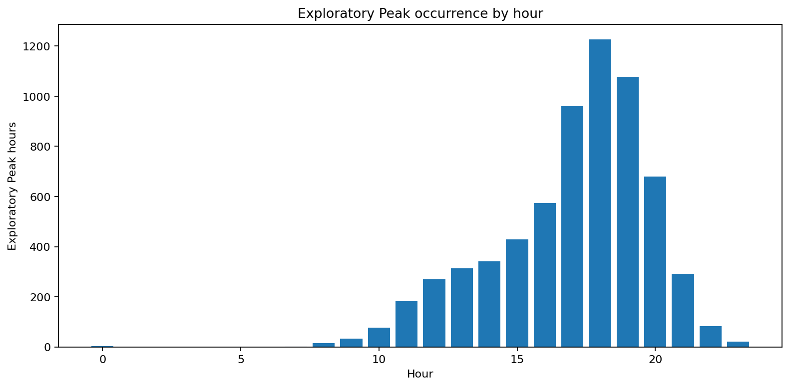

## Highest-demand FSA-days

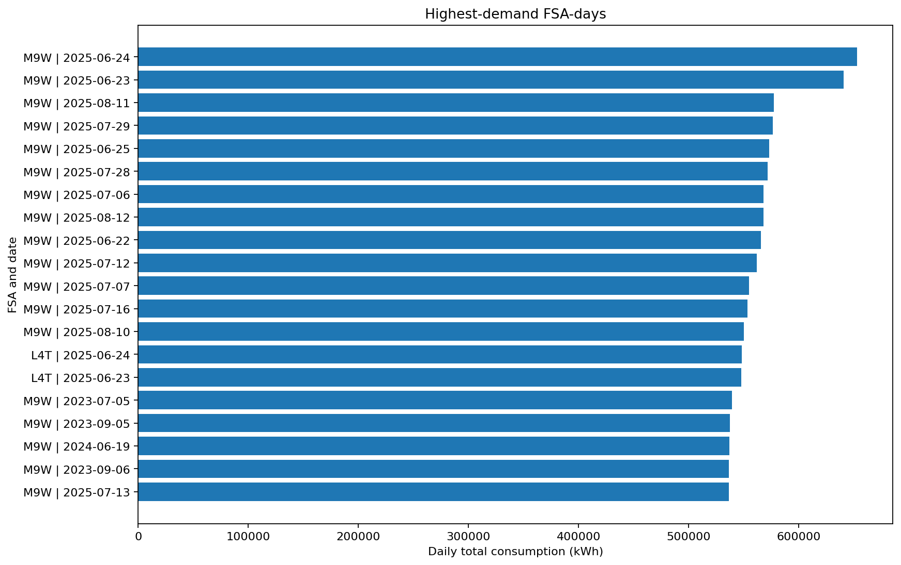

## Exploratory Peak thresholds by FSA and season

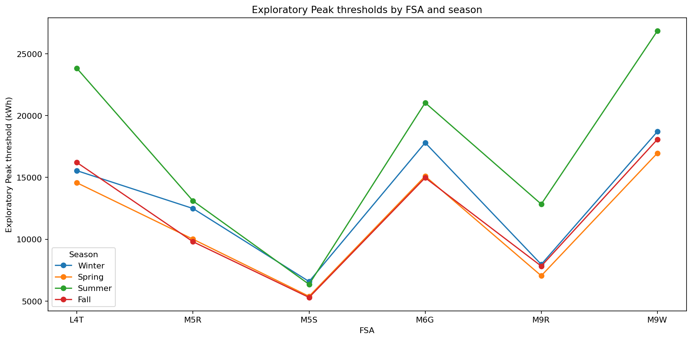

## Exploratory Peaks by hour and season

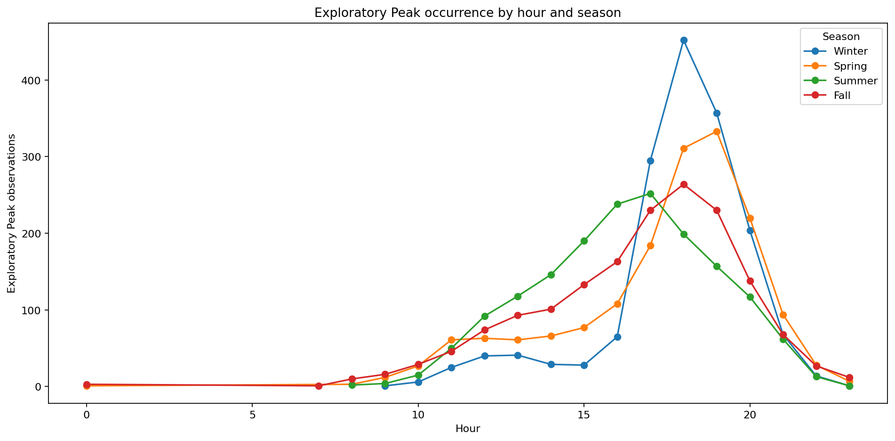

## Temperature extremes by FSA

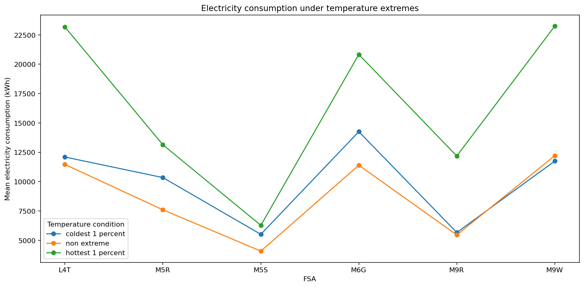

## Exploratory Peaks by weekday

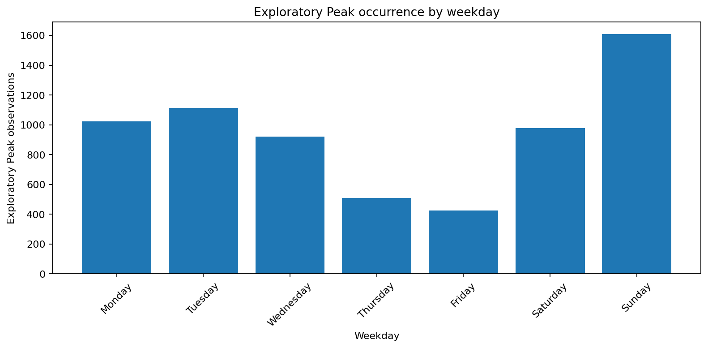

## Exploratory Peaks by month

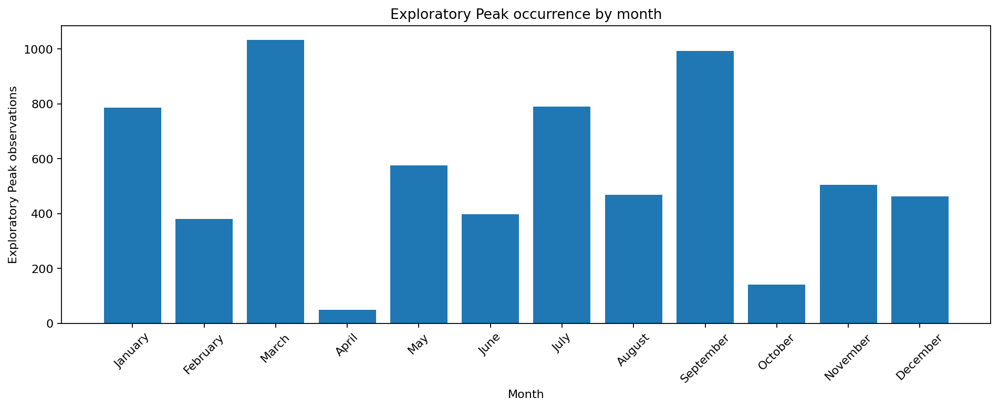

## Exploratory Peak Rate by hour

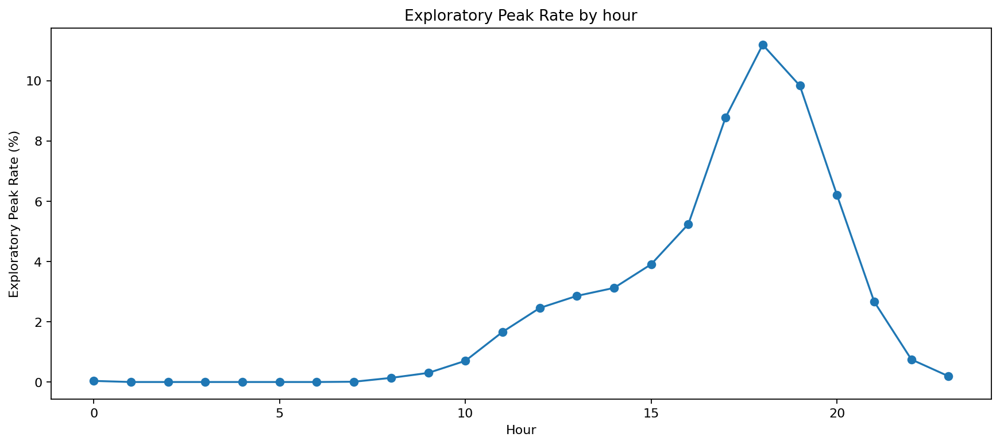

## Exploratory Peak Rate by weekday

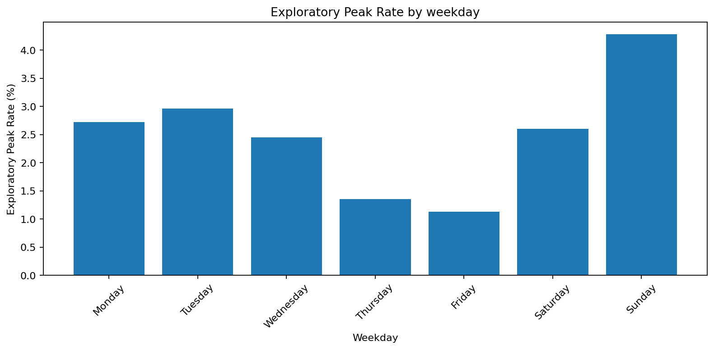

## Exploratory Peak Rate by month

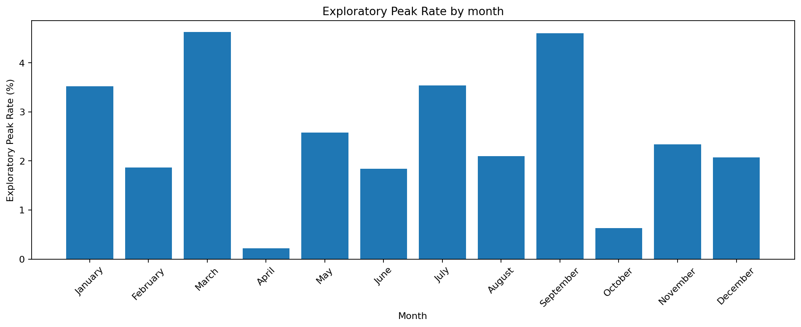

## Exploratory Peak Rate by year

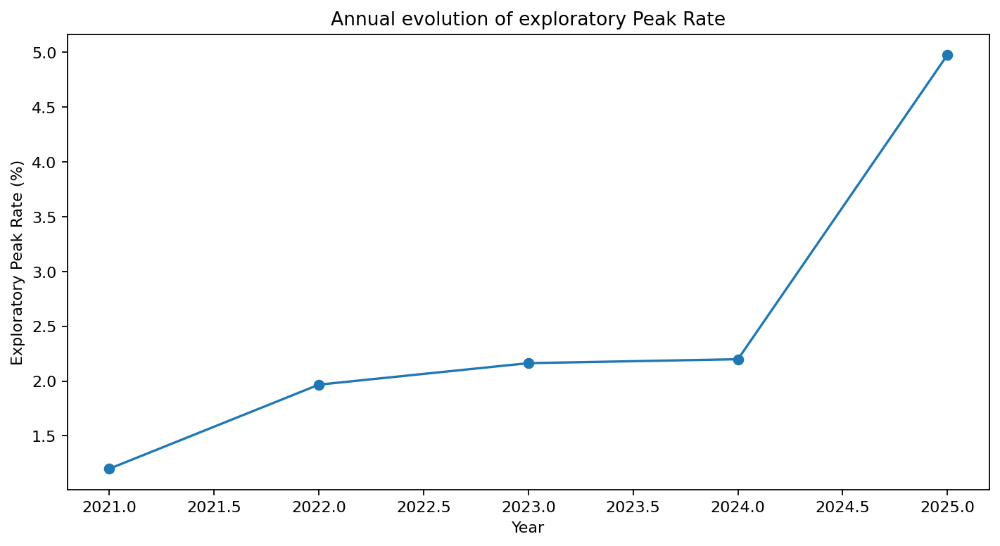

## Exploratory Peak Episode duration distribution

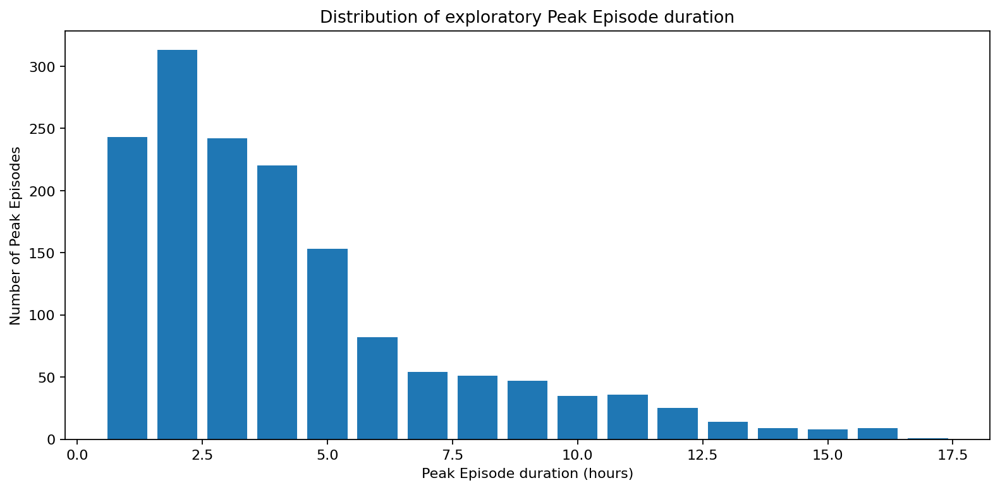
