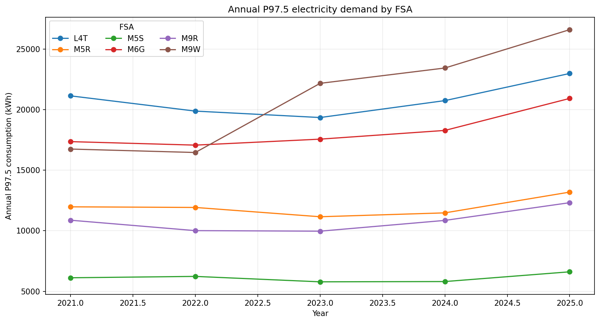
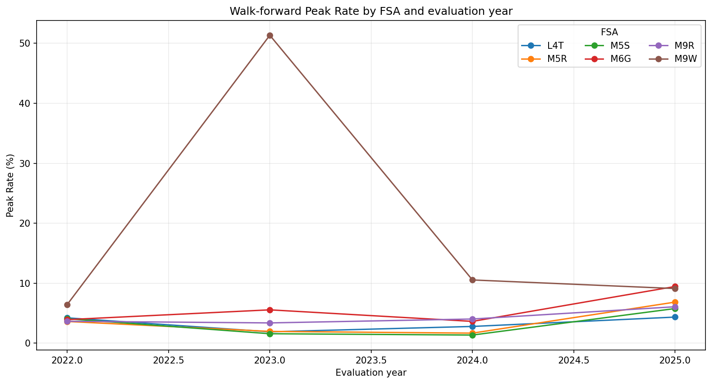
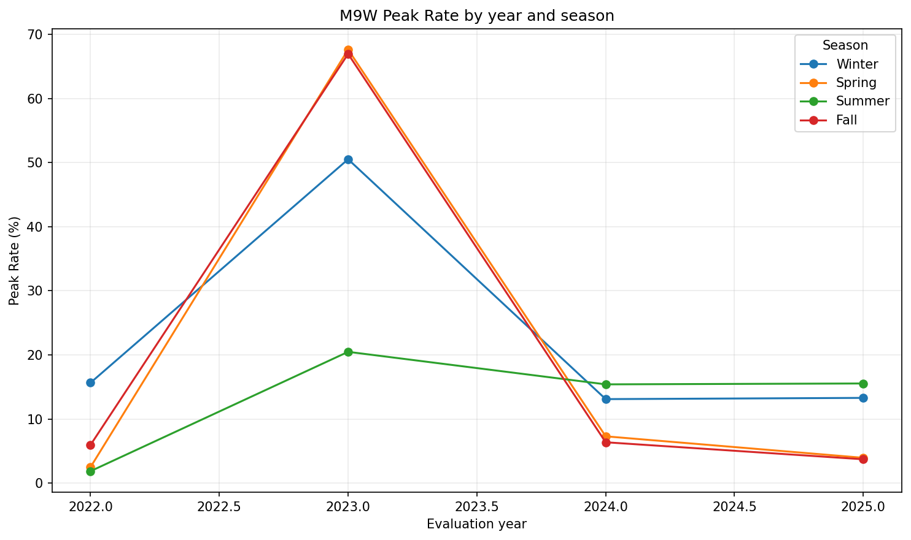
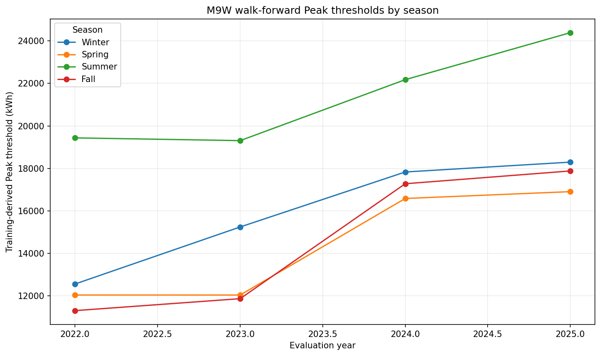
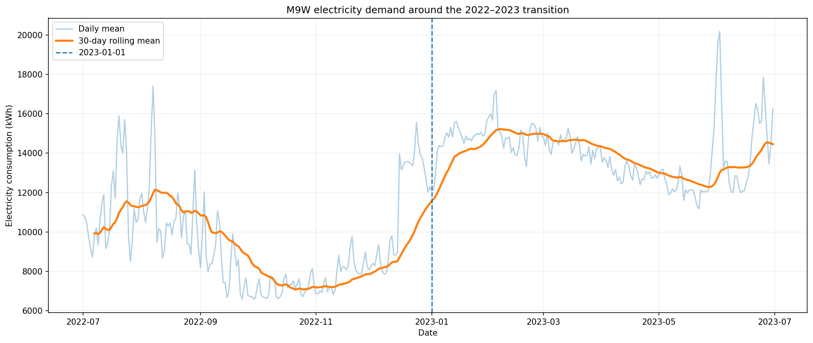
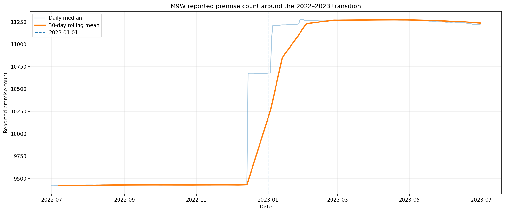

# Target Definition Phase – Overview

## Purpose

Target Definition Phase formally defined and validated the two predictive outcomes used in the project:

1. **Forecasting:** predict hourly electricity consumption for the next 24 hours.
2. **Peak-Risk:** determine whether each future hour represents a Peak event.

This phase did not train predictive models. Its purpose was to establish a common and reproducible target definition that every later model will use under the same rules.

A central principle of the phase was to preserve temporal integrity and prevent data leakage. In particular, Peak-Risk thresholds must be estimated only from information available in the corresponding training period.

---

## Phase Workflow

The Target Definition phase was organized into a sequence of notebooks. Each notebook addressed a specific part of target construction, analysis, or validation.

### `07_00_target_design.ipynb` – Target Design

**Purpose:** Define the Forecasting and Peak-Risk targets before creating target artifacts.

This notebook established the main rules of the phase:

- the prediction unit is an FSA at an hourly forecast origin;
- the Forecasting task predicts the next 24 hourly electricity-consumption values;
- Peak-Risk is treated as a separate binary prediction problem;
- Peak thresholds must not be calculated once from the complete historical dataset;
- Peak thresholds must be learned from training data only.

**Result:** A formal design describing how both targets must be constructed and used consistently during modeling.

---

### `07_01_forecasting_target.ipynb` – Forecasting Target

**Purpose:** Construct the 24-hour electricity-demand target.

Starting from `total_consumption_kwh`, the notebook created the target sequence:

`target_h01, target_h02, ..., target_h24`

For every forecast origin `t`, these fields represent observed electricity consumption at `t+1` through `t+24`.

Targets were aligned using FSA and the corresponding future timestamp rather than relying only on row position. This helps prevent target displacement if an hourly observation is missing.

The process also identified which forecast origins have all 24 future observations available.

**Result:** A consistent 24-hour target matrix that can be shared by all Forecasting models.

---

### `07_02_peak_risk_target.ipynb` – Peak-Risk Target

**Purpose:** Define and test the Peak-Risk labeling policy without introducing future information.

Peak-Risk was defined as:

- `1` = electricity consumption exceeds the applicable Peak threshold;
- `0` = electricity consumption does not exceed the applicable Peak threshold.

The threshold was based on the **97.5th percentile** of electricity demand and calculated separately by **FSA and season**.

The important methodological rule is that thresholds are estimated from the training period only. They are then applied to later observations without recalculating them from the evaluation data.

A walk-forward diagnostic process was used to evaluate the target historically. For example, thresholds used to evaluate 2023 were derived only from earlier years.

**Result:** A reusable and leakage-safe Peak-Risk threshold methodology.

---

### `07_03_target_distribution.ipynb` – Peak-Risk Distribution and Diagnostic Analysis

**Purpose:** Examine whether the Peak-Risk target behaves reasonably before model development.

The notebook evaluated:

- overall Peak / No-Peak balance;
- Peak Rate by FSA;
- Peak Rate by evaluation year;
- Peak Rate by season;
- Peak Rate by FSA and year;
- Peak Rate by FSA, year, and season;
- evolution of electricity-demand percentiles;
- evolution of training-derived Peak thresholds;
- relationship between electricity demand and reported premise count.

This analysis identified an important structural change in the M9W FSA.

---

## M9W Structural Change Investigation

The initial diagnostic results showed that M9W had a much higher Peak Rate than the other FSAs, particularly during 2023. Instead of removing these observations or changing the Peak definition, an additional investigation was performed.

### Annual demand behavior

M9W showed a clear increase in the level of electricity demand beginning around the transition from 2022 to 2023. The increase was visible not only in extreme observations but also in the central and upper parts of the demand distribution.

The annual P97.5 analysis also showed that M9W moved to a substantially higher demand level compared with its 2021–2022 history.



### Peak Rate behavior

The walk-forward analysis showed a particularly high Peak Rate for M9W in 2023. This occurred because the threshold used to evaluate 2023 was derived from the lower-demand historical regime.

After 2023 data became part of the training history, later thresholds increased and the M9W Peak Rate declined substantially.



### Seasonal behavior

The 2023 increase was not limited to a single season. Winter, Spring, and Fall all showed unusually high Peak Rates for M9W, while Summer also increased.

This indicates that the phenomenon was not simply a seasonal weather event but was consistent with a broader shift in the underlying demand level.



### Threshold adaptation

The walk-forward thresholds increased after the new M9W regime entered the training history.

This demonstrates that the threshold methodology responds to changes in demand over time while preserving the anti-leakage rule.



---

## Detailed M9W 2022–2023 Transition Check

A final diagnostic analysis focused on the period from July 2022 through June 2023 to identify when the structural change occurred.

The monthly results showed that the change began before January 2023:

- median daily electricity consumption increased from approximately **7,875 kWh in November 2022** to approximately **12,792 kWh in December 2022**, an increase of about **62.4%**;
- it increased again to approximately **15,534 kWh in January 2023**, approximately **21.4% higher than December**;
- median reported premise count increased from approximately **9,430 in November 2022** to **10,674 in December 2022**, an increase of approximately **13.2%**;
- it increased again to approximately **11,216 in January 2023**.

The largest daily change in reported premise count occurred on **December 15, 2022**, when the median count increased by approximately **1,235 premises (13.1%)**. Additional increases occurred in early January 2023.

These results indicate that the M9W change did not begin exactly on January 1, 2023. A discrete change in the reported population represented by the series began in mid-December 2022 and consolidated in early 2023.





### Interpretation

The demand increase coincides with a substantial increase in `reported_premise_count`.

This does **not** establish that the premise-count increase caused the electricity-demand increase. However, it provides evidence that the M9W series likely experienced a change in the population, coverage, or reporting composition represented by the data.

The change is persistent rather than a small set of isolated outliers. Therefore, the observations were retained.

No manual correction, normalization, deletion of M9W, deletion of 2023 observations, or change to the 97.5th percentile definition was applied.

---

### `07_04_temporal_alignment.ipynb` – Temporal Alignment

**Purpose:** Verify that each Forecasting target refers to the correct future hour.

The notebook checked the relationship:

`information available at time t → target at t+h`

Selected target horizons were compared directly with the original source observations.

**Result:** Confirmation that the constructed Forecasting targets are temporally aligned with the correct FSA and future timestamp.

---

### `07_05_target_validation.ipynb` – Target Validation

**Purpose:** Perform formal structural and anti-leakage validation.

The notebook validated:

- forecast-origin uniqueness;
- preservation of the expected target structure;
- correct alignment for all 24 Forecasting horizons;
- binary Peak-Risk labels;
- consistency between available thresholds and labels;
- use of training years strictly earlier than the evaluation year;
- absence of future-year information in walk-forward threshold construction.

**Result:** The target-construction process passed the implemented structural and anti-leakage checks.

---

### `07_06_target_summary.ipynb` – Target Definition Summary

**Purpose:** Consolidate the results of the phase.

The notebook executed the complete Target Definition workflow and displayed:

- Forecasting target coverage;
- overall diagnostic Peak distribution;
- Forecasting validation results;
- Peak-Risk validation results.

**Result:** A final technical summary of the Target Definition process and its readiness for the modeling stages.

---

### `07_99_run_complete_target_definition.ipynb` – Complete Phase Runner

**Purpose:** Regenerate the complete Target Definition phase after individual notebooks have been reviewed.

This notebook runs the complete Target Definition pipeline using the approved configuration and code.

It provides a reproducible way to recreate the final target artifacts, reports, and documentation without manually executing every exploratory notebook.

**Result:** A single reproducible entry point for rebuilding all formal Phase 7 outputs.

---

## Main Outputs

The Target Definition phase produces the following main target artifacts:

```text
data/processed/target_definition/
├── forecast_target_matrix.parquet
├── forecast_target_complete.parquet
└── peak_risk_diagnostic_labels.parquet
```

The two types of artifacts have different purposes.

### Forecasting targets

`forecast_target_complete.parquet` contains forecast origins with a complete 24-hour observed target horizon and can be used to prepare Forecasting experiments.

### Peak-Risk diagnostic labels

`peak_risk_diagnostic_labels.parquet` contains leakage-safe walk-forward diagnostic labels used to evaluate the target definition.

These labels are **not** intended to become one permanent precomputed target for all Peak-Risk models. During model evaluation, Peak thresholds and labels must be recalculated according to each training window.

---

## Modeling Implications

The Target Definition phase established several requirements for the following modeling stages:

1. All Forecasting models must use the same `h+1 ... h+24` target definition.
2. All model comparisons must preserve chronological evaluation.
3. Peak-Risk thresholds must be fitted using training data only.
4. Peak-Risk performance must be examined not only globally but also by FSA and temporal evaluation period.
5. The M9W structural change must remain part of the evaluation because it represents an important example of non-stationary demand behavior.
6. Forecasting evaluation should also consider performance by forecast horizon.
7. Variables whose availability changes by forecast horizon must be handled according to the information actually available at prediction time.

---

## Target Definition Phase - Conclusion

- Target Definition Phase successfully established a common, validated, and reproducible definition of the Forecasting and Peak-Risk targets.

- The Forecasting target provides 24 future hourly demand values for each valid forecast origin. The Peak-Risk methodology uses training-derived FSA- and season-specific thresholds and preserves temporal separation between training and evaluation data.

- The additional M9W investigation identified a persistent structural level shift beginning in mid-December 2022 and consolidating in early 2023. The shift coincides with a substantial increase in reported premise count and explains why a historically derived Peak threshold produced an unusually high Peak Rate during 2023.

- Because the observed change is persistent and consistent with a change in the underlying series rather than isolated erroneous observations, the data were retained without manual adjustment.

- The project can therefore proceed to the modeling stages while explicitly accounting for temporal non-stationarity, class imbalance, and FSA-specific behavior during evaluation.
